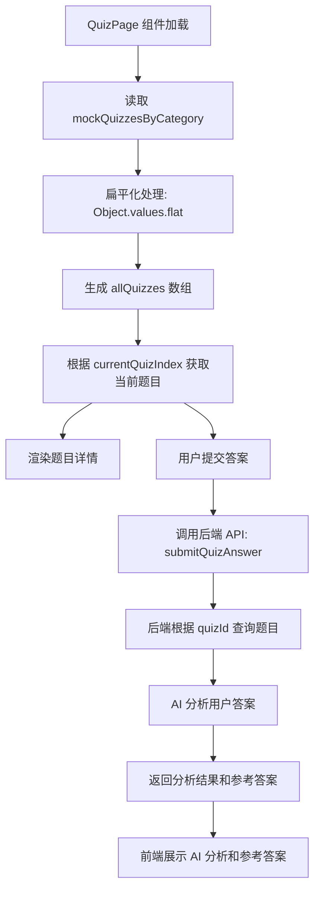
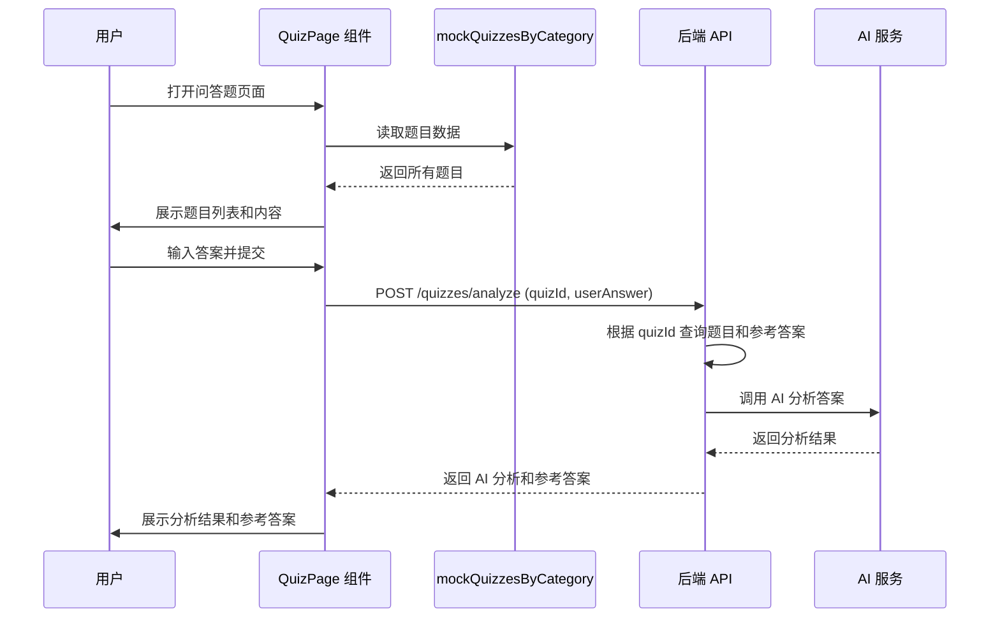
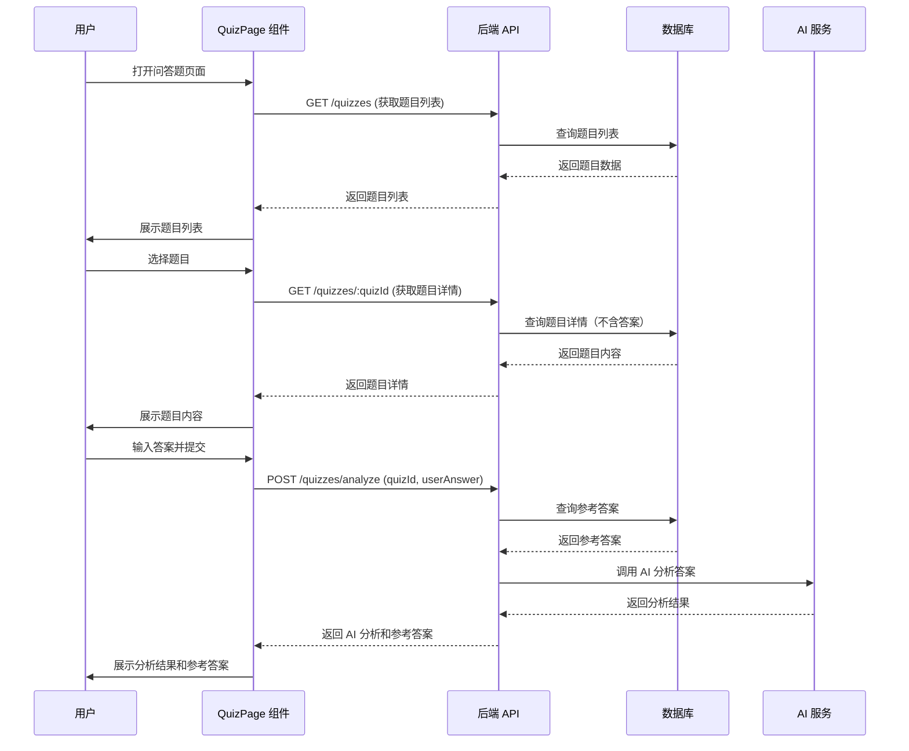

# 问答题数据来源分析

## 分析目标

分析 JavaScript 在线练习系统中问答题功能的数据来源及数据流转机制。

## 数据来源概述

问答题的数据来源采用**前端硬编码模拟数据**的方式，所有问答题数据直接定义在前端组件中，暂未接入后端数据服务。

## 数据源位置

### 主数据源

**文件位置**: `src/pages/QuizPage.jsx`

**数据结构**: 常量对象 `mockQuizzesByCategory`

### 数据组织方式

数据按照技术分类进行组织，采用两层嵌套结构：

| 层级 | 说明 | 示例 |
|------|------|------|
| 第一层 | 技术分类（对象键） | HTML、CSS、JavaScript、React |
| 第二层 | 题目列表（数组值） | 每个分类下包含多个问答题对象 |

### 数据分类

系统当前包含 4 个技术分类：

| 分类名称 | 图标 | 题目数量 | 颜色标识 |
|---------|------|---------|---------|
| HTML | 📄 | 2 题 | #e34c26 |
| CSS | 🎨 | 2 题 | #264de4 |
| JavaScript | ⚡ | 5 题 | #f7df1e |
| React | ⚛️ | 3 题 | #61dafb |

## 题目数据模型

每个问答题包含以下属性：

| 字段名称 | 数据类型 | 必填 | 说明 | 示例值 |
|---------|---------|------|------|--------|
| id | String | 是 | 题目唯一标识 | "html1", "q1" |
| title | String | 是 | 题目标题 | "HTML5 新增的语义化标签" |
| difficulty | String | 是 | 难度等级 | "Easy", "Medium", "Hard" |
| category | String | 是 | 所属分类 | "HTML", "CSS", "JavaScript", "React" |
| question | String | 是 | 题目内容 | 具体问题描述文本 |
| tags | Array<String> | 是 | 标签列表 | ["HTML5", "语义化", "标签"] |
| points | Number | 是 | 分值 | 10, 15, 20 |
| referenceAnswer | String | 是 | 参考答案（Markdown格式） | 标准答案内容 |
| hints | Array<String> | 是 | 提示列表 | ["提示1", "提示2"] |

## 数据使用流程

## 数据获取方式

### 前端数据流转

1. **数据初始化**
   - 组件加载时从 `mockQuizzesByCategory` 读取数据
   - 通过 `Object.values(mockQuizzesByCategory).flat()` 将分类数据扁平化为题目列表

2. **题目选择**
   - 通过 `currentQuizIndex` 状态管理当前选中的题目索引
   - 从 `allQuizzes` 数组中获取对应题目对象

3. **分类展示**
   - 遍历 `mockQuizzesByCategory` 的键（分类名称）
   - 渲染分类标题和该分类下的题目列表

### 后端交互

虽然题目数据来自前端，但在答案提交和分析环节会与后端交互：

| API 端点 | 请求方法 | 说明 | 传递参数 |
|---------|---------|------|---------|
| /quizzes/analyze | POST | 提交答案并获取 AI 分析 | quizId（题目ID）、userAnswer（用户答案） |
| /speech-to-text | POST | 语音转文字 | audioData（音频数据） |

**数据流向说明**：

- 前端将题目 ID（quizId）和用户答案发送到后端
- 后端需要根据题目 ID 查询题目详情（包括参考答案）
- 后端进行 AI 分析后返回结果

## 后端数据需求

### 后端是否有独立题库

基于代码分析，后端**需要具备独立的题库数据**，原因如下：

1. **题目查询需求**
   - 后端 API `/quizzes/analyze` 接收题目 ID
   - 需要根据 ID 查询题目的参考答案进行 AI 对比分析

2. **数据一致性要求**
   - 前后端的题目 ID 必须保持一致
   - 参考答案应在后端存储，确保安全性

3. **扩展性考虑**
   - 未来可能需要支持动态题库
   - 题目管理、统计等功能需要后端数据支持

### 潜在的后端 API

代码中定义但当前未使用的 API：

| API 端点 | 请求方法 | 说明 | 当前状态 |
|---------|---------|------|---------|
| /quizzes | GET | 获取问答题列表 | 已定义（未使用） |
| /quizzes/:quizId | GET | 获取单个问答题详情 | 已定义（未使用） |

## 数据特点分析

### 优点

1. **开发便捷**
   - 前端可独立开发测试，不依赖后端数据服务
   - 数据结构清晰，易于维护和扩展

2. **响应快速**
   - 无需网络请求，题目切换即时响应
   - 减少后端服务压力

3. **数据完整**
   - 包含题目、分类、难度、标签、提示等完整信息
   - 支持 Markdown 格式的参考答案

### 限制

1. **数据固化**
   - 题目内容硬编码在代码中，更新需要重新部署
   - 无法动态添加、删除或修改题目

2. **数据分散**
   - 前后端需要维护两份题库数据
   - 存在数据不一致的风险

3. **安全性问题**
   - 参考答案暴露在前端代码中，用户可直接查看
   - 无法实现答案保护

4. **扩展性受限**
   - 无法支持用户自定义题库
   - 难以实现题目统计、推荐等高级功能

## 改进建议

### 短期优化方向

1. **保留前端数据作为降级方案**
   - 当后端服务不可用时，使用前端模拟数据
   - 提供更好的用户体验

2. **统一数据格式**
   - 前后端使用相同的数据模型
   - 确保数据结构一致性

### 长期演进方向

1. **迁移至后端数据库**
   - 题目数据存储在数据库中
   - 前端通过 API 获取题目列表和详情

2. **实现题目管理后台**
   - 支持题目的增删改查
   - 提供题目分类、标签管理

3. **增强安全性**
   - 参考答案仅在后端存储
   - 提交答案后才返回参考答案

4. **支持动态扩展**
   - 用户权限管理
   - 题目收藏、评论等社区功能

## 数据流转架构

### 当前架构

### 建议架构（未来）

## 相关文件清单

| 文件路径 | 作用 | 包含的数据相关内容 |
|---------|------|------------------|
| src/pages/QuizPage.jsx | 问答题主页面组件 | mockQuizzesByCategory 数据定义、数据使用逻辑 |
| src/api/judgeApi.js | API 接口定义 | fetchQuizzes、fetchQuizDetail、submitQuizAnswer |
| src/components/VoiceRecorder.jsx | 语音录制组件 | 语音输入功能支持 |

## 结论

问答题的数据来源当前为**前端硬编码的模拟数据**，定义在 `QuizPage.jsx` 组件中的 `mockQuizzesByCategory` 常量对象内。该方案适合开发阶段快速迭代，但在生产环境中建议迁移至后端数据库，以提升数据安全性、可维护性和系统扩展性。
